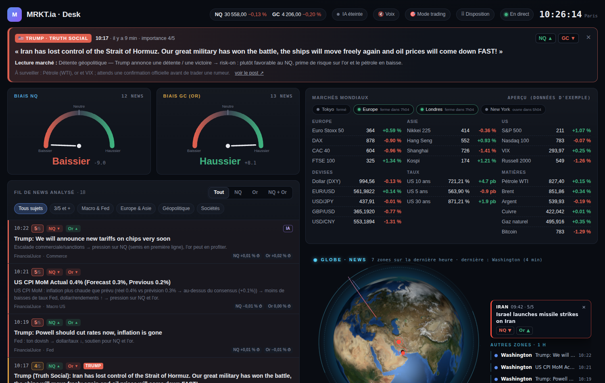
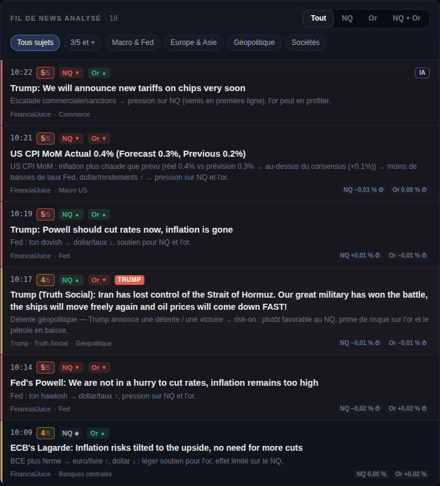
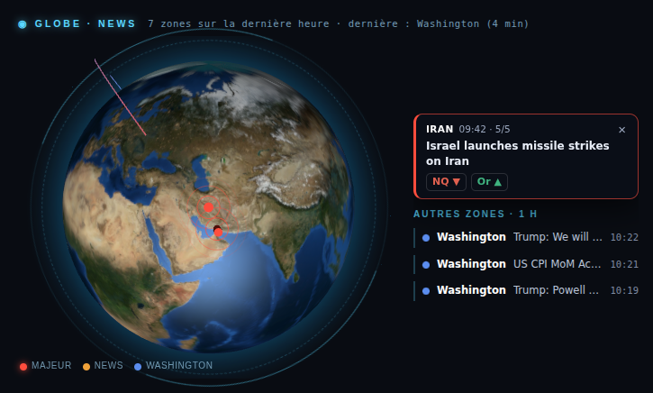
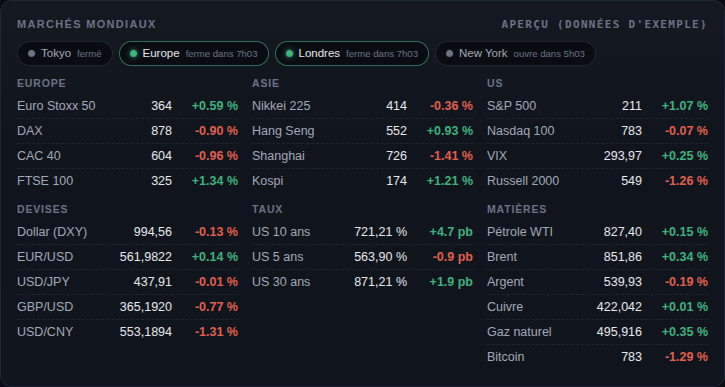
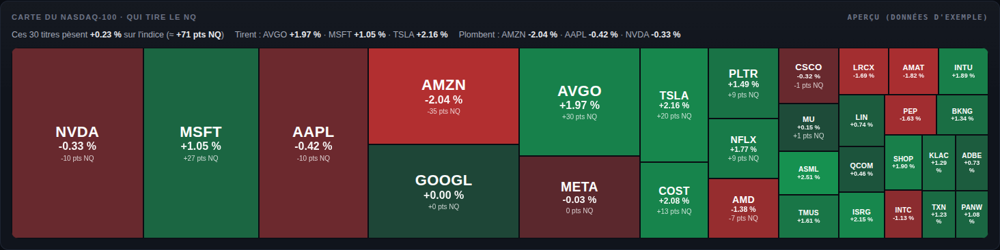
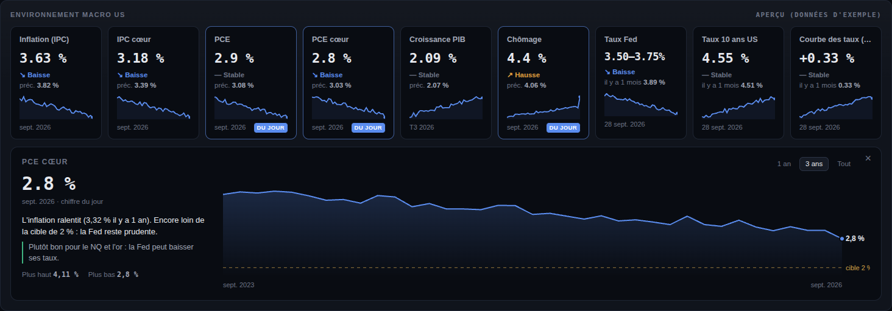

# BloomBerk · Desk

**Ton terminal de marché perso pour trader le Nasdaq (NQ) et l'or (GC).**
Les news qui comptent, notées et expliquées en temps réel. Le calendrier éco, les banques centrales, les directs de Trump et de la Fed : tout est sur un seul écran.

---

## ⬇️ Télécharger

| | |
|---|---|
| 🪟 **Windows** | [**MRKT-ia.zip**](https://github.com/saudade-lab/bloomberk-terminal-/releases/latest/download/MRKT-ia.zip) |
| 🍎 **Mac puce Apple** (M1, M2, M3, M4…) | [**MRKT-mac-arm64.zip**](https://github.com/saudade-lab/bloomberk-terminal-/releases/latest/download/MRKT-mac-arm64.zip) |
| 🍎 **Mac Intel** | [**MRKT-mac-intel.zip**](https://github.com/saudade-lab/bloomberk-terminal-/releases/latest/download/MRKT-mac-intel.zip) |

Ton Mac a quelle puce ? Menu  › *À propos de ce Mac*.

Pas d'installation compliquée ni de compte à créer : tu dézippes, tu lances, et le desk s'ouvre dans ton navigateur.

---

## ✨ Ce que fait le desk

### 📰 Le fil de news, déjà analysé
Chaque news (FinancialJuice, Investing, Truth Social, Fed, BCE, BoJ, BoE…) arrive avec :
- **son heure** et **sa note de 1 à 5** : du bruit au vrai market mover ;
- **l'actif touché** : NQ ▲ / ▼, Or ▲ / ▼ ;
- **une explication en une ligne** de l'effet sur le marché, et d'où vient l'info.

Tu filtres en un clic : **NQ**, **Or**, **NQ + Or** ou tout. Tu peux aussi filtrer par sujet : Macro & Fed, Europe & Asie, Géopolitique, Sociétés.

### 🚨 Les alertes qui comptent vraiment
- **Focus Trump / Fed / BCE / BoJ** : un post important de Trump sur Truth Social, un communiqué de la Fed ou une décision de taux s'affiche en grand, avec la lecture marché.
- **Zone rouge** : compte à rebours avant les gros chiffres US (CPI, NFP, PCE, ISM…) pour ne pas se faire surprendre avec une position ouverte.
- **« Pendant ton absence »** : si ton PC était éteint, un récap des annonces manquées t'attend au retour.
- **Notifs sur ton téléphone** (appli ntfy) et **lecture à voix haute** en option.

### 📅 Calendrier éco US, Europe et Asie
Le **prochain chiffre clé** est en tête avec son compte à rebours. Chaque publication a sa fiche :
- avant le chiffre : le prévu, le précédent et **les scénarios** (au-dessus / en ligne / en dessous → effet NQ et or) ;
- après le chiffre : le réel, la surprise, la lecture Fed et la **réaction du marché** à 1, 5 et 15 min.

### 🌍 Le globe des news
Une Terre en 3D avec le vrai jour et la vraie nuit. Elle tourne toute seule vers la zone où une grosse news vient de tomber (Iran, Ormuz, Chine, Ukraine…), et la fiche de la news s'affiche à côté.

### 🌐 Marchés mondiaux & macro
- **Marchés mondiaux** : indices Europe / Asie / US, devises, taux, pétrole, or, bitcoin, et les sessions Tokyo / Londres / New York en direct.
- **Carte du Nasdaq-100** : quels titres tirent ou plombent le NQ, en points d'indice.
- **Environnement macro US** : inflation, PCE, chômage, PIB, taux Fed, 10 ans, courbe… avec une lecture « en clair » de ce que ça veut dire pour le NQ et l'or.
- **Ce que parie le marché** : les probabilités Kalshi / Polymarket (décision Fed, CPI, récession…).

### 💼 Earnings des gros poids du Nasdaq
Les dates des résultats (Nvidia, Apple, Microsoft, Meta, Tesla…) avec leur poids dans l'indice. Chaque société a sa fiche : attentes, 3 derniers trimestres et santé de la boîte.

### 🎙 Les directs de Trump et de la Fed
Colle le lien d'un direct YouTube : le desk l'affiche dans une fenêtre flottante, le transcrit et sort **les phrases clés qui touchent l'économie**, puis fait un récap à la fin.

### 🤖 L'IA (optionnelle) : branche la tienne
- **Synthèse du marché** toutes les 30 min, avec un biais NQ et or.
- **Analyse poussée** d'une news en un clic : contexte, scénario NQ, scénario or, ce qu'il faut surveiller.
- **Directs Trump / Fed** : les phrases clés et le récap de fin.

Chacun branche **sa propre IA, avec sa propre clé**. Ça se passe dans le menu **Mon IA** (bouton IA en haut du desk → *Changer*) :

| IA | Prix indicatif | Pour qui |
|---|---|---|
| **Ollama** | gratuit | tourne sur ton PC, sans clé (`Installer-IA.bat`) ; lent sur un petit PC |
| **DeepSeek** | quelques centimes / jour | rapide et très peu cher |
| **Claude** (Anthropic) | Haiku : centimes / jour | très bon en analyse et en français |
| **OpenAI** (GPT) | modèles « mini » : centimes / jour | prends un « mini » pour le desk |
| **Mistral** | petits modèles : centimes / jour | IA française |
| **Groq** | palier gratuit limité | ultra rapide |
| **OpenRouter** | selon le modèle | une seule clé pour presque toutes les IA |

Comment ça marche :
1. Tu colles ta clé dans le menu Mon IA.
2. Le desk affiche la liste des modèles dispo sur ton compte, tu choisis.
3. Tu cliques sur **Tester et utiliser** : ça bascule tout de suite, sans redémarrer.

🔒 Ta clé reste sur ton PC (dossier AppData) : jamais dans le dossier de l'app, le zip ou GitHub, et elle n'est jamais réaffichée.

Les alertes et les notes /5, elles, ne dépendent jamais de l'IA : elles restent instantanées, même sans clé ou sans solde.

### 🧰 Et aussi
- **Récaps du desk** à 8h et 14h.
- **Mode trading** : une vue épurée avec juste le biais, les grosses news, le globe et le prochain chiffre.
- **Disposition libre** : tu déplaces, retires et remets les panneaux comme tu veux.
- **Sur ton téléphone** : le desk s'affiche aussi sur ton tel (voir plus bas).
- **NinjaTrader 8** : prix en direct et réaction du marché à chaque news.

---

## 🛠 Installation

<b>🪟 Windows (2 min)</b>

1. Dézippe le dossier `MRKT-ia` où tu veux (par exemple sur le Bureau).
2. Double-clique sur **MrktIaWatcher.exe**. Si Windows affiche « Windows a protégé votre ordinateur », clique sur *Informations complémentaires* → *Exécuter quand même*.
3. Ouvre **http://localhost:5057** dans ton navigateur (ou double-clique sur *Ouvrir-Dashboard*).

Le fichier **LISEZMOI.txt** du dossier explique le reste : notifs sur téléphone, IA, NinjaTrader.

<b>🍎 Mac (3 min)</b>

1. Double-clique sur le zip : un dossier `MRKT-ia` apparaît. Range-le où tu veux (par exemple dans Documents).
2. **Première fois seulement** : ouvre l'app **Terminal**, tape `bash ` (avec un espace), glisse le fichier `lancer.sh` du dossier dans la fenêtre, puis Entrée. Ça débloque l'app (macOS bloque les apps qui ne viennent pas de l'App Store) et ça la lance.
3. Les fois suivantes : double-clique sur **Lancer MRKT.command**.
4. Le desk s'ouvre sur **http://localhost:5057**.

Sur Mac, les prix viennent de Yahoo Finance (différés d'environ 10 min), car NinjaTrader n'existe pas sur Mac.

<b>📱 Sur ton téléphone</b>

Le desk tourne sur ton PC, et ton téléphone l'affiche dans son navigateur.

1. Dans le `appsettings.json` de MRKT, mets `"DashboardLan": true`, lance **Autoriser-reseau.bat** une fois (clic droit → *Exécuter en tant qu'administrateur*), puis relance MRKT.
2. **À la maison (même wifi)** : ouvre sur ton tel l'adresse affichée en bas du desk (« Sur ton tel : même wifi … »).
3. **Partout (4G)** : installe [Tailscale](https://tailscale.com/download) (gratuit) sur le PC et sur le tel, connecte-les au même compte, relance MRKT et ouvre l'adresse « partout (Tailscale) ».
4. Ajoute la page à l'écran d'accueil pour l'ouvrir comme une appli.

### 🔄 Mises à jour
Elles sont automatiques : quand une nouvelle version sort, un bandeau apparaît dans le desk. Un clic sur **Installer** et c'est fait, tes réglages sont gardés.

---

© 2026 Alexandre (saudade-lab) · BloomBerk / MRKT.ia · tous droits réservés. 
Usage personnel uniquement : ne pas revendre, redistribuer ou modifier sans accord. 
<b>Ce n'est pas un conseil financier.</b> Le trading de futures comporte un risque de perte en capital.

