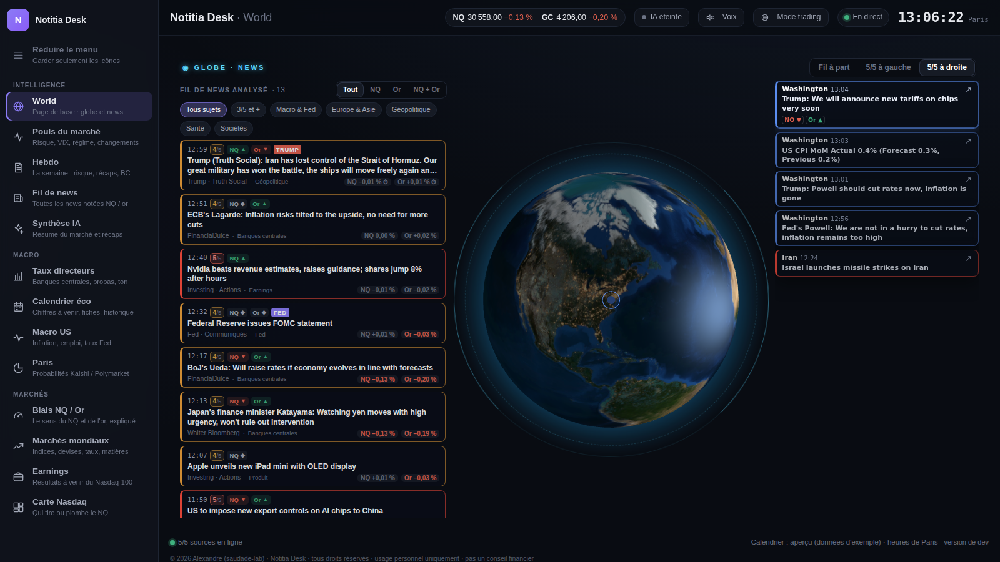
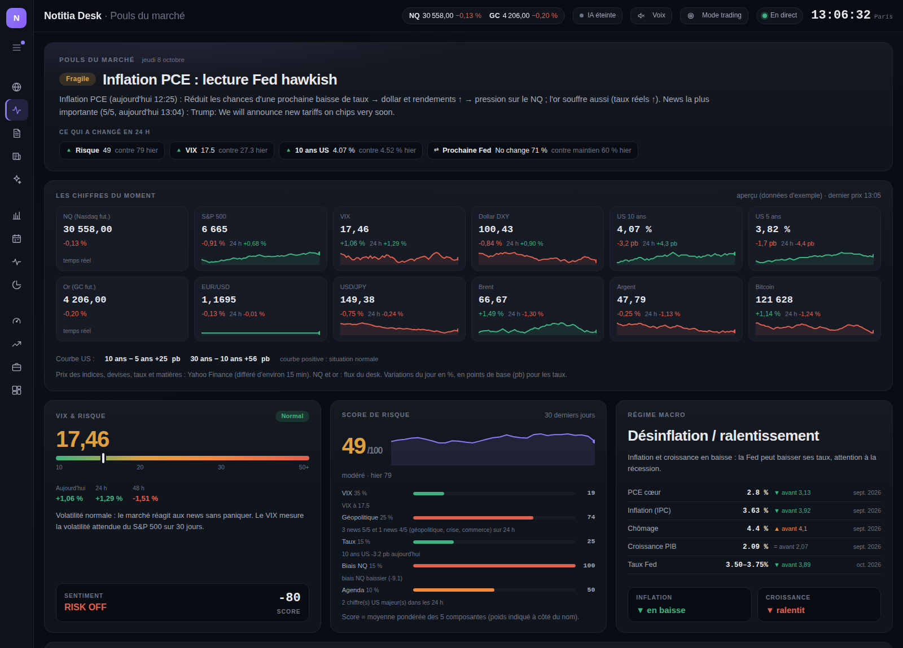
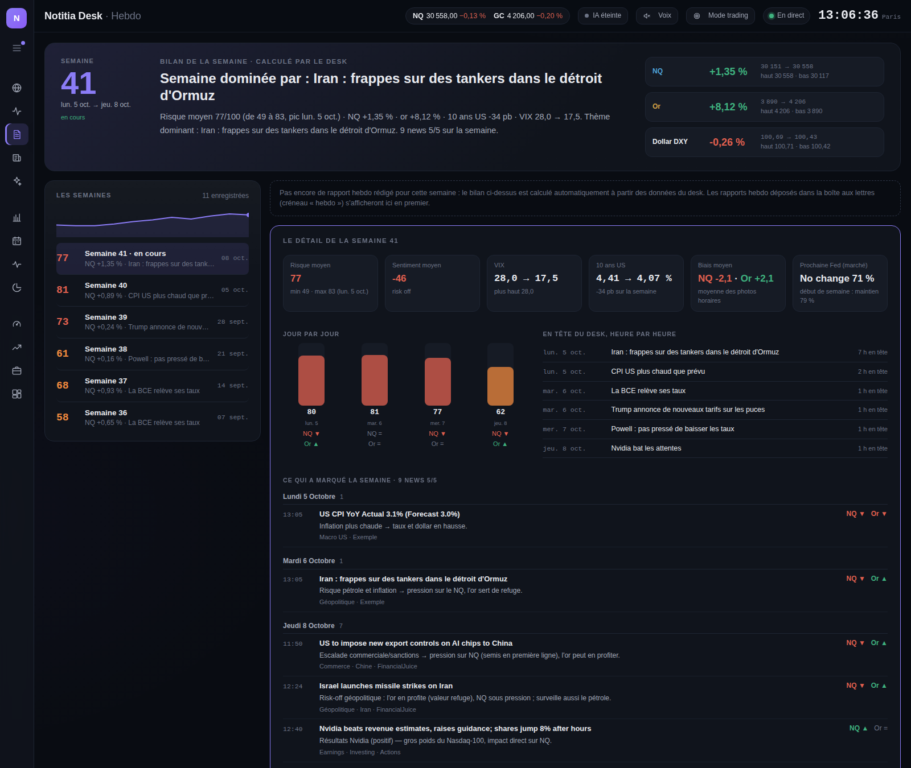
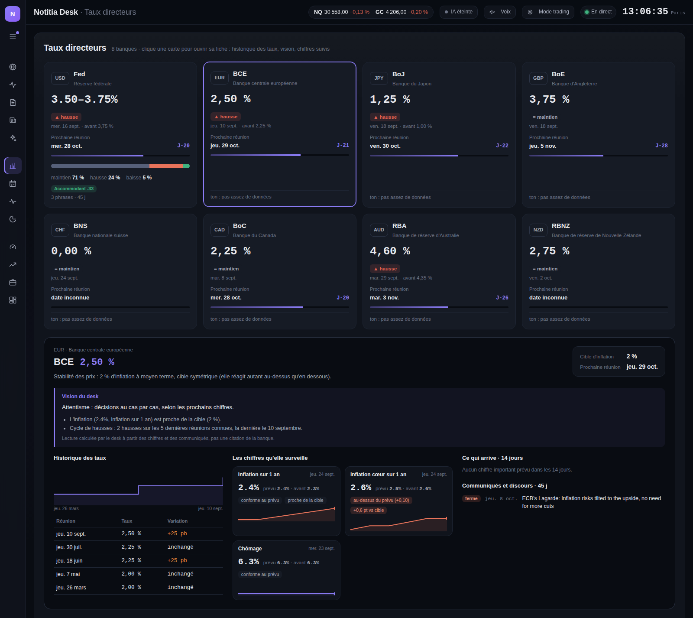
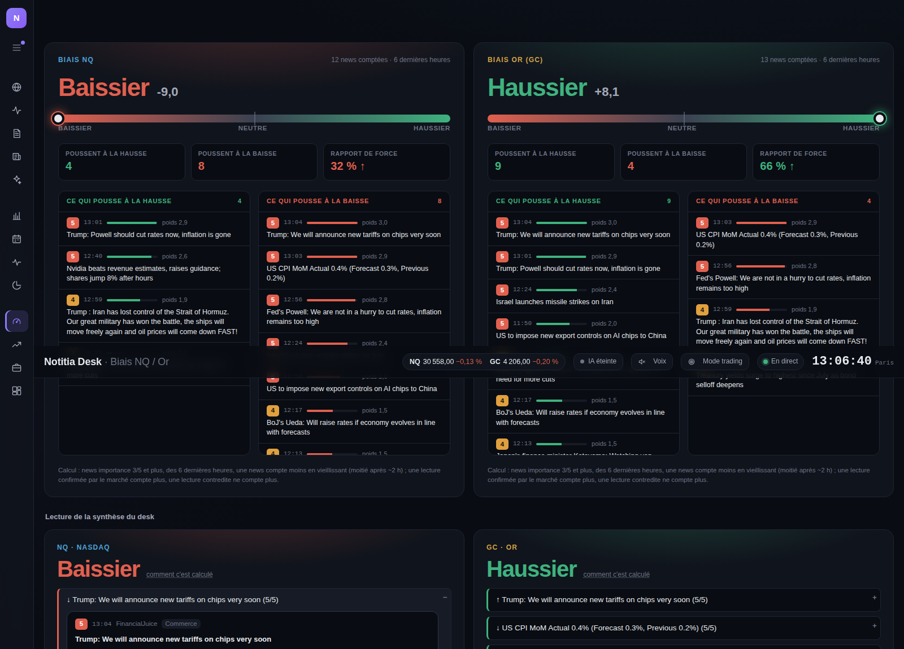
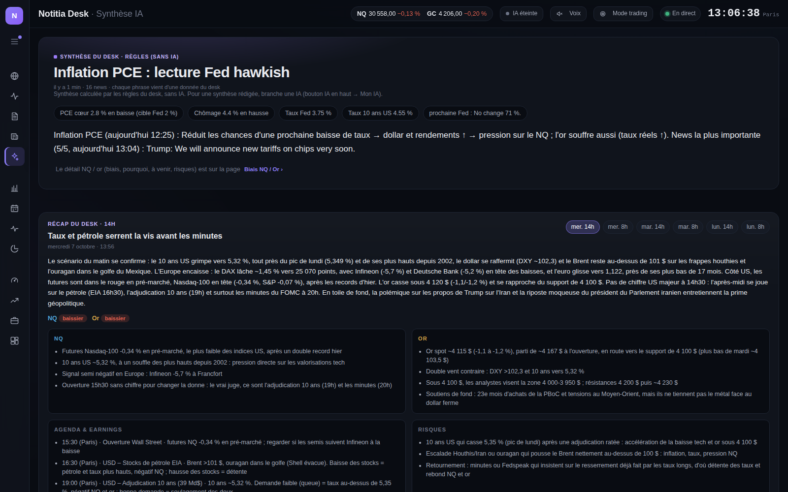
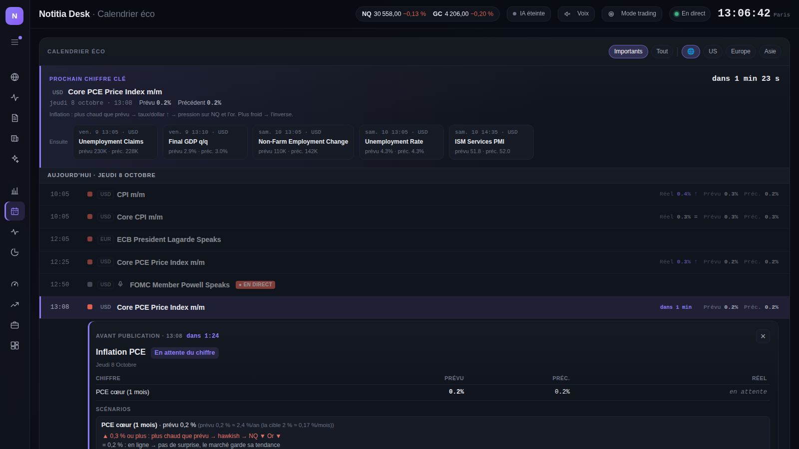
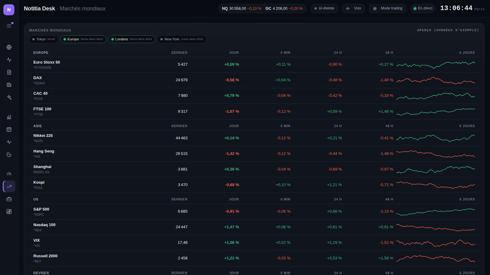
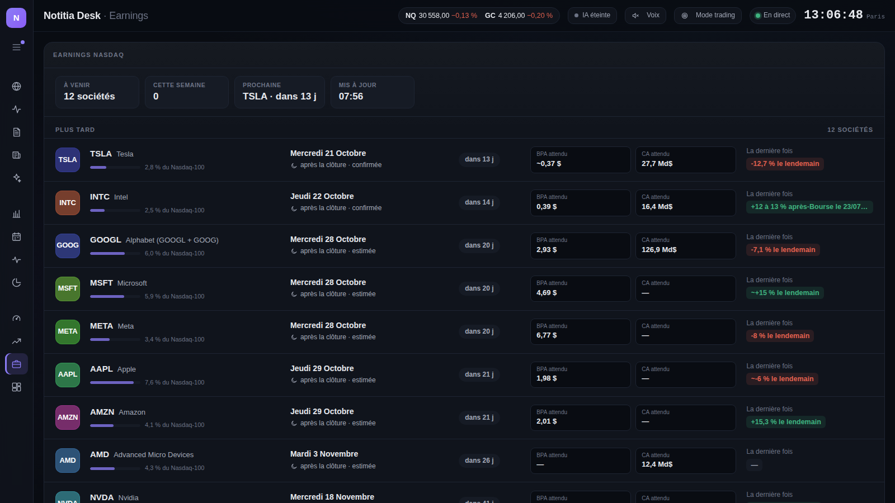

# Notitia Desk

**Ton terminal de marché perso pour trader le Nasdaq (NQ) et l'or (GC).**
Les news qui comptent, notées et expliquées en temps réel. Le calendrier éco, les banques centrales, le risque du moment et le bilan de chaque semaine, chacun à sa place dans un seul desk.

---

## Télécharger

| | |
|---|---|
| **Windows** | [**Notitia-Desk.zip**](https://github.com/saudade-lab/notitia-desk/releases/latest/download/Notitia-Desk.zip) |
| **Mac puce Apple** (M1, M2, M3, M4…) | [**Notitia-Desk-mac-arm64.zip**](https://github.com/saudade-lab/notitia-desk/releases/latest/download/Notitia-Desk-mac-arm64.zip) |
| **Mac Intel** | [**Notitia-Desk-mac-intel.zip**](https://github.com/saudade-lab/notitia-desk/releases/latest/download/Notitia-Desk-mac-intel.zip) |

Ton Mac a quelle puce ? Menu Pomme › *À propos de ce Mac*.

Pas d'installation compliquée ni de compte à créer : tu dézippes, tu lances, et le desk s'ouvre dans ton navigateur. Les liens ci-dessus donnent toujours la dernière version.

---

## Comment c'est organisé

Le desk s'ouvre sur le **globe** avec les news. Chaque sujet a ensuite sa propre page, dans le menu à gauche. Le menu reste discret (juste des icônes) : tire la petite languette ou clique sur le bouton du haut pour l'élargir et voir le nom et la description de chaque page.

| Section | Pages |
|---|---|
| **Intelligence** | World (globe et news) · Pouls du marché · Hebdo · Fil de news · Synthèse IA |
| **Macro** | Taux directeurs · Calendrier éco · Macro US · Paris (Kalshi / Polymarket) |
| **Marchés** | Biais NQ / Or · Marchés mondiaux · Earnings · Carte Nasdaq |

Le bouton **Mode trading** en haut ouvre ton écran trading : tu choisis toi-même ce qu'il affiche (globe, news, pouls du marché…).

---

## Les pages

### World : le globe au centre, les news autour
La page de base. Une Terre en 3D (vrai jour, vraie nuit) qui tourne toute seule vers l'endroit où une grosse news vient de tomber (Iran, Ormuz, Chine, Ukraine…).
- **D'un côté, les news 5/5** : les vrais market movers, avec le lieu, l'heure et l'effet NQ / or.
- **De l'autre, tout le fil de news** analysé, que tu fais défiler et filtres en un clic (NQ, Or, 3/5 et +, Macro & Fed, Géopolitique, Santé, Sociétés…).
- Tu choisis où vont les 5/5 : à gauche, à droite, ou « Fil à part ».

Quand une nouvelle 5/5 tombe, sa **fiche complète** s'ouvre à côté : la source et les sources qui la confirment, l'effet NQ / or, le pourquoi, ce qu'il faut surveiller, la réaction du marché dans les minutes qui suivent et l'analyse IA.

### Pouls du marché : où en est le marché, en chiffres
Tout ce qu'il faut savoir avant de prendre une position, sur une page :
- **La synthèse du moment** et **ce qui a changé en 24 h** (risque, VIX, 10 ans, probabilités Fed, biais).
- **Les chiffres du moment** : NQ, S&P 500, VIX, dollar, taux US, or, euro, yen, Brent, argent, bitcoin, avec la variation du jour, sur 24 h et une mini-courbe. La source et l'heure du dernier prix sont indiquées.
- **La courbe des taux US** (10 ans − 5 ans, 30 ans − 10 ans) et ce qu'elle veut dire.
- **Le score de risque sur 100**, calculé à partir du VIX, de la géopolitique, des taux, du biais NQ et de l'agenda. Chaque composante affiche sa vraie valeur et son poids, avec l'historique sur 30 jours.
- **Le régime macro** (inflation × croissance) avec les derniers chiffres US.
- **Le biais du desk** NQ / or et les news qui pèsent le plus.

### Hebdo : le bilan de chaque semaine, gardé en mémoire
- **Le bilan de la semaine**, écrit automatiquement par le desk : risque moyen et pic, performance du NQ, de l'or et du dollar (début → fin, plus haut, plus bas), 10 ans, VIX, thème dominant, décisions de banques centrales et chiffres hors consensus.
- **Toutes les news 5/5 de la semaine**, classées par jour, avec leur explication et leur effet NQ / or. Elles sont gardées en mémoire (environ 13 mois) : tu cliques sur une semaine passée et tu retrouves son bilan et ses 5/5.
- **Le jour par jour** (risque, biais NQ et or) et **les chiffres de la semaine** (inflation, emploi, PIB, ISM, décisions de taux, US et zone euro) avec publié / prévu / avant et la surprise.
- Pour la semaine en cours : **ce qui arrive la semaine prochaine** (réunions de banques centrales, gros chiffres) et les plus forts / plus faibles des marchés.
- Les **rapports hebdo** rédigés s'affichent en tête de leur semaine.

### Taux directeurs : les 8 grandes banques centrales
Fed, BCE, BoJ, BoE, BNS, BoC, RBA et RBNZ en cartes : taux actuel, dernière décision, compte à rebours jusqu'à la prochaine réunion, ton de leurs communiqués. Pour la Fed : les probabilités du marché pour la prochaine réunion et le biais de chaque membre du comité.

Un clic sur une banque ouvre **sa fiche** :
- son mandat et sa cible d'inflation ;
- **la vision du desk** : où en est l'inflation par rapport à la cible, cycle de hausses ou de baisses, ton récent ;
- **l'historique des taux** en graphique et réunion par réunion ;
- **les chiffres qu'elle surveille** (inflation, inflation cœur, chômage…) avec publié, prévu, l'écart à la cible et une mini-courbe ;
- ce qui sort dans les 14 jours et ses derniers communiqués.

### Biais NQ / Or : le sens du marché, expliqué
Le biais du NQ et de l'or sur une jauge, avec les news qui poussent à la hausse et celles qui poussent à la baisse, et leur poids. En dessous, la lecture de la synthèse : clique sur le biais pour voir comment il est calculé, ou sur une ligne pour retrouver la news d'origine, pourquoi elle pèse et **comment le marché a vraiment réagi** (5 et 15 min). Avec ce qui arrive et les risques à surveiller.

### Synthèse IA et récaps du desk
Une note de marché à lire en 30 secondes avant de trader : le thème du moment, le régime macro (inflation, chômage, Fed, 10 ans) et le résumé. Juste en dessous, **le récap du desk** de 8 h et 14 h, en entier : NQ, or, agenda, earnings et risques.
- **Sans IA**, le desk écrit la synthèse lui-même à partir de ses données, en continu.
- **Avec une IA**, elle est rédigée par l'IA toutes les heures (voir plus bas).

### Calendrier éco US, Europe et Asie
Le **prochain chiffre clé** est en haut avec son compte à rebours, suivi des prochains gros chiffres. Un clic sur un événement ouvre sa fiche juste en dessous :
- avant le chiffre : le prévu, le précédent, **les scénarios** (au-dessus / en ligne / en dessous → effet NQ et or) et **les dernières publications** ;
- après le chiffre : le réel, la surprise, la lecture Fed et la réaction du marché à 1, 5 et 15 min.

### Marchés, macro et earnings
- **Marchés mondiaux** : indices Europe / Asie / US, devises, taux, matières premières et bitcoin, avec les variations sur 5 min, 24 h et 48 h. Un clic sur une ligne ouvre ses stats sur 1 an.
- **Carte du Nasdaq-100** : quels titres tirent ou plombent le NQ, en points d'indice.
- **Macro US** : inflation, PCE, chômage, PIB, taux Fed, 10 ans… avec la courbe et les stats au clic, et une lecture « en clair » pour le NQ et l'or.
- **Earnings** des gros poids du Nasdaq, semaine par semaine, avec la fiche de chaque société : attentes, derniers trimestres et santé de la boîte.
- **Paris** : ce que parie le marché sur Kalshi / Polymarket (décision Fed, CPI, récession…).

---

## Sous le capot

### Un moteur de notation qui apprend du marché
Les notes /5 viennent d'un moteur de règles spécialisé macro. Il n'a pas besoin d'IA et réagit instantanément :
- **La surprise compte, pas le chiffre** : un CPI à +0,1 point au-dessus du consensus est une vraie surprise, un NFP à +20K c'est du bruit.
- **Vérifié par le marché** : 10 min après chaque news importante, le desk regarde si le NQ et l'or ont bougé dans le sens annoncé. Les news contredites pèsent moins dans le biais.
- **Il apprend** : un type de news souvent contredit ces dernières semaines est noté plus prudemment.
- **Rumeurs et démentis** valent moins qu'une annonce officielle. La même info confirmée par 3 sources monte d'un cran.

Les sources : FinancialJuice, investingLive, Walter Bloomberg, Truth Social, CNBC, Fed, BCE, BoJ, BoE, BNS, BoC, RBA, et les sources géopolitiques et santé (épidémies).

### Les alertes qui comptent vraiment
- **Focus Trump / Fed / BCE / BoJ** : un post important de Trump, un communiqué de la Fed ou une décision de taux s'affiche en grand, avec la lecture marché.
- **Zone rouge** : compte à rebours avant les gros chiffres US (CPI, NFP, PCE, ISM…).
- **« Pendant ton absence »** : si ton PC était éteint, un récap des annonces manquées t'attend.
- **Notifs sur ton téléphone** (appli ntfy) et **lecture à voix haute** en option.
- **Directs Trump et Fed** : colle le lien d'un direct YouTube, le desk le transcrit, sort les phrases clés qui touchent l'économie et fait un récap à la fin.

### L'IA (optionnelle) : un stratégiste macro qui ne s'invente rien
- **Synthèse du marché** toutes les heures, avec un biais NQ et or.
- **Analyse poussée** d'une news : le fait, la surprise, la lecture Fed, le canal (taux, dollar, risque, refuge), les scénarios NQ et or, ce qui les annulerait.
- **Chiffres vérifiés** : chaque chiffre et chaque heure écrits par l'IA sont comparés aux données du desk. Un chiffre introuvable, c'est une phrase corrigée ou retirée, et le desk te le signale.

Chacun branche **sa propre IA, avec sa propre clé**, dans le menu **Mon IA** (bouton IA en haut du desk → *Changer*) :

| IA | Prix indicatif | Pour qui |
|---|---|---|
| **Ollama** | gratuit | tourne sur ton PC, sans clé (`Installer-IA.bat`) ; lent sur un petit PC |
| **DeepSeek** | quelques centimes / jour | rapide et très peu cher |
| **Claude** (Anthropic) | Haiku : centimes / jour | très bon en analyse et en français |
| **OpenAI** (GPT) | modèles « mini » : centimes / jour | prends un « mini » pour le desk |
| **Mistral** | petits modèles : centimes / jour | IA française |
| **Groq** | palier gratuit limité | ultra rapide |
| **OpenRouter** | selon le modèle | une seule clé pour presque toutes les IA |

Tu colles ta clé, tu choisis le modèle dans la liste, tu cliques sur **Tester et utiliser** : ça bascule tout de suite, sans redémarrer. Ta clé reste sur ton PC (dossier AppData) : jamais dans le dossier de l'app, le zip ou GitHub.

Les alertes et les notes /5 ne dépendent jamais de l'IA : elles restent instantanées, même sans clé.

### Et aussi
- **Écran trading à composer** : bouton **Mode trading**, puis **Disposition** pour déplacer, redimensionner ou retirer les panneaux.
- **Sur ton téléphone** : le desk s'affiche aussi sur ton tel (voir plus bas).
- **NinjaTrader 8** : prix en direct, réaction du marché à chaque news et vérification des lectures. Sans NinjaTrader, les prix viennent de Yahoo Finance (différés).

---

## Installation

<b>Windows (2 min)</b>

1. Dézippe le dossier `Notitia-Desk` où tu veux (par exemple sur le Bureau).
2. Double-clique sur **NotitiaDesk.exe**. Si Windows affiche « Windows a protégé votre ordinateur », clique sur *Informations complémentaires* → *Exécuter quand même*.
3. Ouvre **http://localhost:5057** dans ton navigateur (ou double-clique sur *Ouvrir-Dashboard*).

Le fichier **LISEZMOI.txt** du dossier explique le reste : notifs sur téléphone, IA, NinjaTrader.

<b>Mac (3 min)</b>

1. Double-clique sur le zip : un dossier `Notitia-Desk` apparaît. Range-le où tu veux (par exemple dans Documents).
2. **Première fois seulement** : ouvre l'app **Terminal**, tape `bash ` (avec un espace), glisse le fichier `lancer.sh` du dossier dans la fenêtre, puis Entrée. Ça débloque l'app (macOS bloque les apps qui ne viennent pas de l'App Store) et ça la lance.
3. Les fois suivantes : double-clique sur **Lancer Notitia.command**.
4. Le desk s'ouvre sur **http://localhost:5057**.

Sur Mac, les prix viennent de Yahoo Finance (différés d'environ 10 min), car NinjaTrader n'existe pas sur Mac.

<b>Sur ton téléphone</b>

Le desk tourne sur ton PC, et ton téléphone l'affiche dans son navigateur.

1. Dans le `appsettings.json` de Notitia, mets `"DashboardLan": true`, lance **Autoriser-reseau.bat** une fois (clic droit → *Exécuter en tant qu'administrateur*), puis relance Notitia.
2. **À la maison (même wifi)** : ouvre sur ton tel l'adresse affichée en bas du desk (« Sur ton tel : même wifi … »).
3. **Partout (4G)** : installe [Tailscale](https://tailscale.com/download) (gratuit) sur le PC et sur le tel, connecte-les au même compte, relance Notitia et ouvre l'adresse « partout (Tailscale) ».
4. Ajoute la page à l'écran d'accueil pour l'ouvrir comme une appli.

### Mises à jour
Elles sont automatiques : quand une nouvelle version sort, un bandeau apparaît dans le desk. Un clic sur **Installer** et c'est fait, tes réglages sont gardés.

---

© 2026 Alexandre (saudade-lab) · Notitia Desk · tous droits réservés. 
Usage personnel uniquement : ne pas revendre, redistribuer ou modifier sans accord. 
<b>Ce n'est pas un conseil financier.</b> Le trading de futures comporte un risque de perte en capital.

