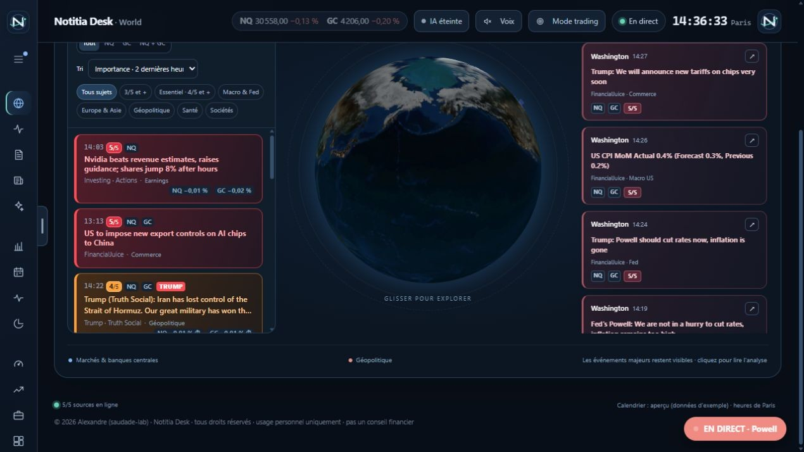
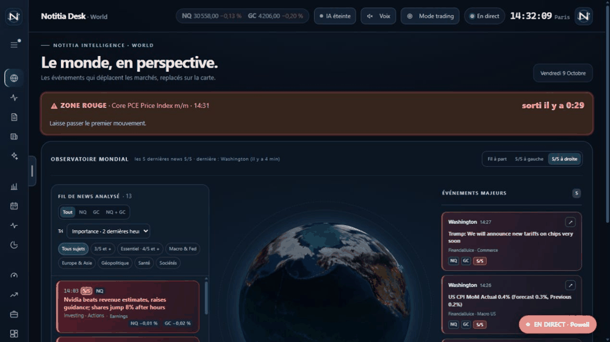
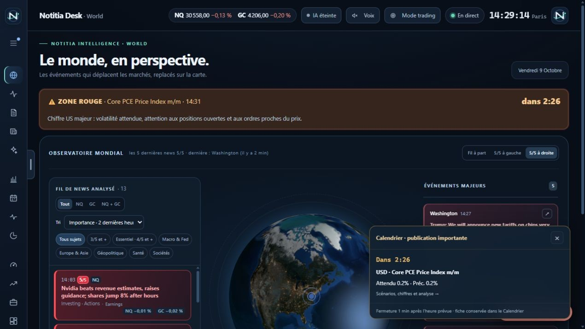

# Notitia Desk

**Les news, la macro et la géopolitique réunies dans un desk pour NQ et GC.**

Notitia Desk collecte les informations de plusieurs sources, les classe par importance et explique ce qu’elles peuvent changer pour le Nasdaq-100 (**NQ**) et les futures Gold (**GC**). Le dashboard s’ouvre dans votre navigateur, avec un globe interactif et des pages consacrées aux marchés, au calendrier et aux entreprises.

La veille et le classement par règles fonctionnent sans clé API. L’IA est optionnelle : locale avec Ollama ou connectée au fournisseur de votre choix, selon ses conditions et tarifs.



*Captures réalisées avec le mode aperçu : chiffres, news et analyses de démonstration, sans valeur de cotation ni d’actualité réelle.*

**[Télécharger la dernière version](https://github.com/saudade-lab/notitia-desk/releases/latest)** · **[Visite visuelle complète](docs/demo.html)** · **[Galerie des pages](docs/GALERIE.md)**

## Découvrir le desk



L’animation parcourt les treize pages principales. Pour choisir une page et avancer à votre rythme, ouvrez **`docs/demo.html`** dans votre navigateur après avoir téléchargé le dossier. La visite est une présentation interactive de captures, pas une application connectée aux marchés. Sur GitHub, utilisez la [galerie](docs/GALERIE.md) : le fichier HTML n’y est pas exécuté.

## Ce que vous pouvez suivre

| Page | Ce qu’elle apporte |
|---|---|
| **World** | Globe 3D, fil de news et événements majeurs sur les côtés. |
| **Pouls du marché** | Risque, volatilité, régime macro et changements récents. |
| **Hebdo** | Vue de la semaine, rapports et contexte des banques centrales. |
| **Fil de news** | Classement, filtres par sujet et actif, source et détails de chaque information. |
| **Synthèse IA et récaps** | Synthèses du desk et récaps partagés du matin, de l’après-midi et de la semaine. |
| **Taux directeurs** | Décisions, contexte et suivi des grandes banques centrales. |
| **Calendrier économique** | Attendu, précédent, réel, scénarios et rapports de publication. |
| **Environnement macro US** | Inflation, emploi, croissance et contexte monétaire. |
| **Kalshi / Polymarket** | Probabilités de marchés de prédiction, selon la disponibilité des services. |
| **Biais NQ / GC** | Orientation du desk et explication des informations qui la composent. |
| **Marchés mondiaux** | Indices, devises, taux et matières premières. |
| **Earnings Nasdaq** | Résultats d’entreprises importantes du Nasdaq, dates et détails disponibles. |
| **Carte Nasdaq-100** | Vue des valeurs qui soutiennent ou pèsent sur l’indice. |

### Repérer ce qui compte

Les news **5/5 ressortent en rouge**, les **4/5 en orange**. Les filtres permettent de suivre NQ, GC, les deux actifs ou un sujet : macro, banques centrales, géopolitique, entreprises…

Le desk rapproche les doublons entre sources. Au démarrage, les informations déjà en ligne remplissent le dashboard sans déclencher une rafale d’alertes ; les nouvelles informations peuvent ensuite alerter selon vos seuils.

Une news reçue apparaît directement dans le dashboard. L’envoi des notifications est séparé de la collecte pour que les alertes ne ralentissent pas l’arrivée des autres sources.

### Le calendrier, avant et après le chiffre

**Cinq minutes avant** une publication économique importante, un popup apparaît sur World et le desk avec le compte à rebours. Cliquez pour retrouver le chiffre attendu, le précédent et les scénarios possibles.

**Dès réception du résultat**, le desk affiche le réel et, pour les publications US prises en charge, une première analyse par règles : surprise face au consensus, lecture Fed et implications possibles pour NQ et GC. Une analyse IA peut compléter la fiche lorsqu’elle est disponible.

**Une minute après l’heure prévue**, le popup disparaît. Le résultat et le rapport restent consultables dans le calendrier, y compris lorsqu’ils arrivent en retard.



### Des récaps communs à tous

Les récaps français partagés couvrent les marchés et la géopolitique : **8 h et 14 h du lundi au vendredi**, plus un **récap hebdomadaire**, en heure de Paris. Ils sont distribués séparément des mises à jour de l’application. Les faits sont distingués des scénarios et accompagnés de sources.

## Commencer

### Version prête à lancer

1. Téléchargez l’archive correspondant à votre système dans les [releases](https://github.com/saudade-lab/notitia-desk/releases/latest).
2. Décompressez-la dans un dossier et suivez le fichier `LISEZMOI` fourni.
3. Sous Windows, lancez **`NotitiaDesk.exe`** et laissez la fenêtre du moteur ouverte ou réduite.
4. Le dashboard s’ouvre dans le navigateur, habituellement à **http://localhost:5057**. Si ce port est occupé, utilisez l’adresse indiquée au lancement.

Les distributions autonomes évitent d’installer .NET séparément. Les archives Mac, lorsqu’elles sont présentes dans la release, distinguent Apple Silicon et Intel.

### Depuis les sources

Avec le SDK .NET 8 installé, lancez `Lancer-Notitia.bat` sous Windows, ou exécutez :

```sh
dotnet run -c Release
```

Pour découvrir l’interface avec des données d’exemple :

```sh
dotnet run -c Release -- --preview
```

L’aperçu ne représente pas les marchés réels. Ne lancez pas une seconde instance de veille sur le même poste pour accélérer les flux.

## IA, prix et notifications

- **Mon IA** : le menu IA du dashboard permet de choisir un fournisseur, un modèle et de tester la connexion. Chaque utilisateur emploie sa propre clé. Ollama permet une analyse locale ; les services externes peuvent facturer leur utilisation.
- **Prix NQ / GC** : le pont NinjaTrader est optionnel pour recevoir les prix depuis vos graphiques. Sans lui, les prix de secours peuvent être différés ; regardez leur source et leur horodatage.
- **Alertes** : notifications Windows et son sur le PC ; ntfy et Discord sont optionnels et se configurent individuellement. Le seuil du téléphone peut être différent de celui du PC.

Les premières lectures par règles et les analyses IA sont distinctes. Une analyse IA plus longue ne signifie pas que le résultat économique n’a pas encore été reçu.

## Rapidité des flux et mises à jour

Chaque source conserve sa propre cadence. Les flux rapides sont interrogés plus souvent que les flux qui imposent des limites. FinancialJuice respecte son cache, les délais annoncés par le serveur et un ralentissement progressif en cas de refus. Le desk ne peut pas afficher une information que la source n’a pas encore rendue disponible.

Les versions distribuées recherchent normalement les mises à jour environ **toutes les deux minutes**. Quand une nouvelle version est détectée, une installation automatique est proposée après un compte à rebours de **30 secondes**, avec possibilité de la reporter. Le moteur redémarre brièvement puis le dashboard recharge la nouvelle version ; vous n’avez pas à fermer tout le desk manuellement.

La version de développement sur le poste de maintenance conserve son fonctionnement distinct : **les mises à jour de l’application sont publiées manuellement par le mainteneur depuis son PC**.

## Confidentialité et partage

Les clés ajoutées via **Mon IA** sont conservées dans l’espace local de l’utilisateur. Les notifications et les fournisseurs IA externes reçoivent les informations nécessaires à la fonctionnalité choisie : les traitements ne sont donc pas tous locaux lorsque ces options sont activées.

Les distributions sont préparées et publiées par le mainteneur, après vérification des archives. Les utilisateurs téléchargent les versions disponibles et reçoivent leurs mises à jour dans le desk. Les outils de publication et la clé GitHub du mainteneur ne sont pas inclus dans les distributions. **Ne partagez pas directement votre dossier de travail**, votre configuration personnelle, les caches, journaux, tokens ou webhooks.

Les images de ce README viennent d’un aperçu isolé avec des données fictives. La visite visuelle ne demande aucun compte et n’utilise aucune clé.

## Usage

Notitia Desk est un outil de veille. Les biais, scénarios, scores et probabilités ne constituent pas des recommandations d’investissement. Les données peuvent être retardées ou indisponibles ; consultez les sources, les horaires et les résultats réels.

© 2026 saudade-lab — Notitia Desk. Tous droits réservés. Les composants tiers conservent leurs licences respectives.
