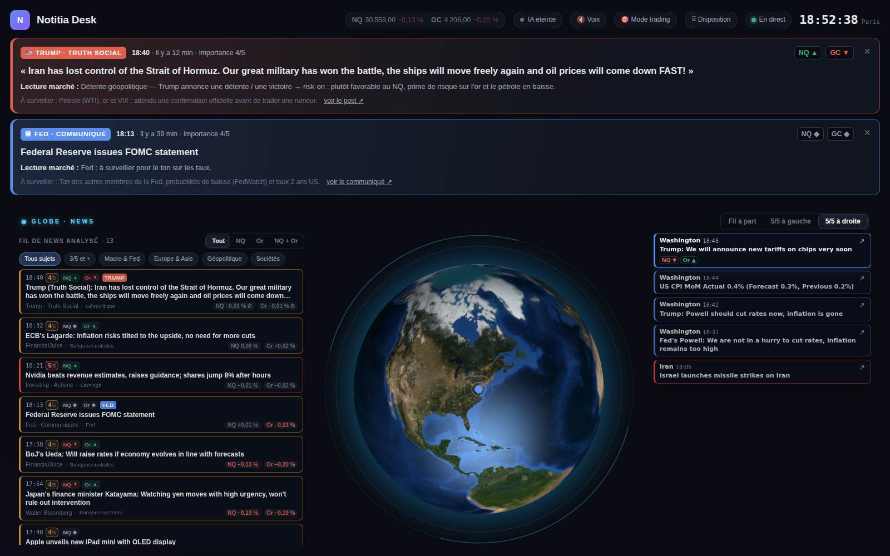
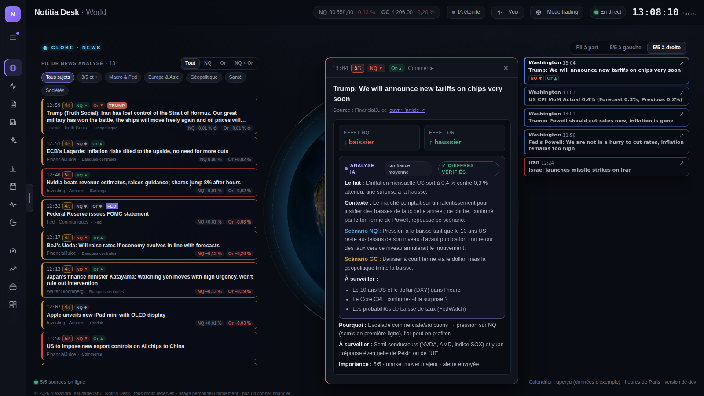
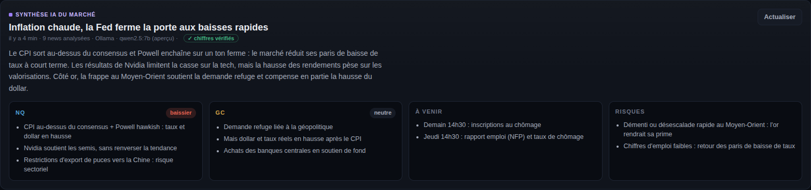
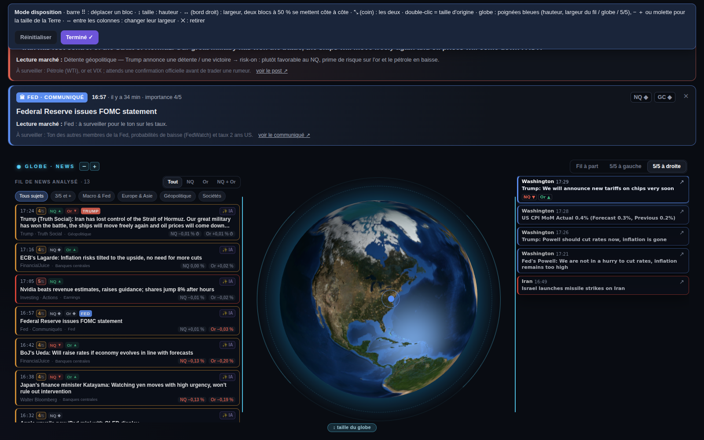

# Notitia Desk

**Ton terminal de marché perso pour trader le Nasdaq (NQ) et l'or (GC).**
Les news qui comptent, notées et expliquées en temps réel. Le calendrier éco, les banques centrales, les directs de Trump et de la Fed : tout est sur un seul écran.

---

## ⬇️ Télécharger

| | |
|---|---|
| 🪟 **Windows** | [**Notitia-Desk.zip**](https://github.com/saudade-lab/notitia-desk/releases/latest/download/Notitia-Desk.zip) |
| 🍎 **Mac puce Apple** (M1, M2, M3, M4…) | [**Notitia-Desk-mac-arm64.zip**](https://github.com/saudade-lab/notitia-desk/releases/latest/download/Notitia-Desk-mac-arm64.zip) |
| 🍎 **Mac Intel** | [**Notitia-Desk-mac-intel.zip**](https://github.com/saudade-lab/notitia-desk/releases/latest/download/Notitia-Desk-mac-intel.zip) |

Ton Mac a quelle puce ? Menu  › *À propos de ce Mac*.

Pas d'installation compliquée ni de compte à créer : tu dézippes, tu lances, et le desk s'ouvre dans ton navigateur.

---

## ✨ Ce que fait le desk

### 🌍 Le globe au centre, les news autour
Le cœur du desk : une Terre en 3D (vrai jour, vraie nuit) qui tourne toute seule vers l'endroit où une grosse news vient de tomber (Iran, Ormuz, Chine, Ukraine…).
- **D'un côté, les news 5/5** : les vrais market movers, avec le lieu, l'heure et l'effet NQ / or.
- **De l'autre, tout le fil de news** analysé, que tu fais défiler.
- Tu choisis où vont les 5/5 : **à gauche** ou **à droite**. Ou bien **« Fil à part »** pour remettre le fil de news dans son propre panneau.

**Fiche de la news** : quand une nouvelle 5/5 tombe, sa fiche complète s'ouvre toute seule à côté de la colonne. Elle reste jusqu'à ce que tu la fermes (✕). Un clic sur n'importe quelle 5/5 l'ouvre aussi. Dans la fiche :
- la source, les autres sources qui la confirment et le lien de l'article ;
- l'effet NQ / or, le pourquoi et ce qu'il faut surveiller ;
- la réaction du marché dans les minutes qui suivent ;
- l'analyse IA, ou le bouton pour la lancer.

### 📰 Le fil de news, déjà analysé
Chaque news (FinancialJuice, investingLive, Walter Bloomberg, Truth Social, Fed, BCE, BoJ, BoE, CNBC…) arrive avec :
- **son heure** et **sa note de 1 à 5**, du bruit au vrai market mover ;
- **l'actif touché** : NQ ▲ / ▼, Or ▲ / ▼ ;
- **une explication en une ligne** de l'effet sur le marché, et d'où vient l'info.

Rien n'est jeté : même les news de bruit (1/5) restent visibles, en plus discret. Tu filtres en un clic : **NQ**, **Or**, **NQ + Or**, **3/5 et +**, ou par sujet (Macro & Fed, Europe & Asie, Géopolitique, Sociétés).

### 🧠 Un moteur de notation qui apprend du marché
Les notes /5 viennent d'un moteur de règles spécialisé macro. Il n'a pas besoin d'IA et réagit instantanément :
- **La surprise compte, pas le chiffre** : un CPI à +0,1 point au-dessus du consensus est une vraie surprise, un NFP à +20K c'est du bruit. Chaque chiffre est comparé à sa taille de surprise habituelle.
- **Vérifié par le marché** : 10 min après chaque news importante, le desk regarde si le NQ et l'or ont bougé dans le sens annoncé (✓ confirmé, ⇄ inverse, calme). Les news contredites par le marché pèsent moins dans le biais.
- **Il apprend** : si un type de news est souvent contredit par le marché ces dernières semaines, il est noté plus prudemment.
- **Rumeurs et démentis** : « selon des sources » ou un démenti valent moins qu'une annonce officielle. La même info confirmée par 3 sources monte d'un cran.

### 🚨 Les alertes qui comptent vraiment
- **Focus Trump / Fed / BCE / BoJ** : un post important de Trump sur Truth Social, un communiqué de la Fed ou une décision de taux s'affiche en grand, avec la lecture marché.
- **Zone rouge** : compte à rebours avant les gros chiffres US (CPI, NFP, PCE, ISM…), pour ne pas te faire surprendre avec une position ouverte.
- **« Pendant ton absence »** : si ton PC était éteint, un récap des annonces manquées t'attend au retour.
- **Notifs sur ton téléphone** (appli ntfy) et **lecture à voix haute** en option.

### 📅 Calendrier éco US, Europe et Asie
Le **prochain chiffre clé** est en tête avec son compte à rebours. Un clic sur un événement ouvre sa fiche, sans faire bouger ta page :
- avant le chiffre : le prévu, le précédent et **les scénarios** (au-dessus / en ligne / en dessous → effet NQ et or) ;
- après le chiffre : le réel, la surprise, la lecture Fed et la **réaction du marché** à 1, 5 et 15 min.

### 📝 La synthèse du marché, avec ou sans IA
Une note de marché à lire en 30 secondes avant de trader : le thème du moment, le régime macro (inflation, chômage, Fed, 10 ans), le biais NQ et le biais or avec leurs arguments, ce qui arrive et les risques.
- **Sans IA**, le desk l'écrit lui-même à partir de ses données : chaque phrase vient d'un chiffre ou d'une news du desk. Elle est mise à jour en continu.
- **Avec une IA**, elle est rédigée par l'IA toutes les heures (voir plus bas).

### 🌐 Marchés mondiaux & macro
- **Marchés mondiaux** : indices Europe / Asie / US, devises, taux, pétrole, or, bitcoin, et les sessions Tokyo / Londres / New York en direct.
- **Carte du Nasdaq-100** : quels titres tirent ou plombent le NQ, en points d'indice.
- **Environnement macro US** : inflation, PCE, chômage, PIB, taux Fed, 10 ans, courbe… avec une lecture « en clair » de ce que ça veut dire pour le NQ et l'or.
- **Ce que parie le marché** : les probabilités Kalshi / Polymarket (décision Fed, CPI, récession…).

### 💼 Earnings des gros poids du Nasdaq
Les dates des résultats (Nvidia, Apple, Microsoft, Meta, Tesla…) avec leur poids dans l'indice. Chaque société a sa fiche : attentes, 3 derniers trimestres et santé de la boîte.

### 🎙 Les directs de Trump et de la Fed
Colle le lien d'un direct YouTube : le desk l'affiche dans une fenêtre flottante, le transcrit et sort **les phrases clés qui touchent l'économie**, puis fait un récap à la fin.

### 🤖 L'IA (optionnelle) : un stratégiste macro qui ne s'invente rien
- **Synthèse du marché** toutes les heures, avec un biais NQ et or.
- **Analyse poussée** d'une news : le fait, la surprise, la lecture Fed, le canal (taux, dollar, risque, refuge), le scénario NQ, le scénario or, ce qui l'annulerait et ce qu'il faut surveiller.
- **Directs Trump / Fed** : les phrases clés et le récap de fin.

L'IA travaille comme un stratégiste de salle de marché :
- **Elle voit tout le desk** : prix, taux, dollar, régime macro, anticipations Fed, chiffres sortis, déclarations et agenda.
- **Elle suit une méthode macro fixe** : fait → surprise → Fed → canal → scénarios.
- **La surprise d'un chiffre est calculée par le desk**, jamais laissée à l'IA.
- **✓ Chiffres vérifiés** : chaque chiffre et chaque heure écrits par l'IA sont comparés aux données du desk. Un chiffre introuvable, c'est une phrase corrigée ou retirée, et le desk te le signale.

Chacun branche **sa propre IA, avec sa propre clé**. Ça se passe dans le menu **Mon IA** (bouton IA en haut du desk → *Changer*) :

| IA | Prix indicatif | Pour qui |
|---|---|---|
| **Ollama** | gratuit | tourne sur ton PC, sans clé (`Installer-IA.bat`) ; lent sur un petit PC |
| **DeepSeek** | quelques centimes / jour | rapide et très peu cher |
| **Claude** (Anthropic) | Haiku : centimes / jour | très bon en analyse et en français |
| **OpenAI** (GPT) | modèles « mini » : centimes / jour | prends un « mini » pour le desk |
| **Mistral** | petits modèles : centimes / jour | IA française |
| **Groq** | palier gratuit limité | ultra rapide |
| **OpenRouter** | selon le modèle | une seule clé pour presque toutes les IA |

Comment ça marche :
1. Tu colles ta clé dans le menu Mon IA.
2. Le desk affiche la liste des modèles dispo sur ton compte, tu choisis.
3. Tu cliques sur **Tester et utiliser** : ça bascule tout de suite, sans redémarrer.

🔒 Ta clé reste sur ton PC (dossier AppData) : jamais dans le dossier de l'app, le zip ou GitHub, et elle n'est jamais réaffichée.

Les alertes et les notes /5 ne dépendent jamais de l'IA : elles restent instantanées, même sans clé ou sans solde.

### 🧩 Ton desk, ta disposition
Clique sur **Disposition** en haut du desk :
- **Déplace** les panneaux, **retire-les** et remets-les quand tu veux.
- **Hauteur et largeur** de chaque panneau à la souris. Deux panneaux à 50 % se mettent côte à côte.
- **Globe** : règle sa hauteur, la largeur du fil / du globe / des 5/5, et la taille de la Terre (− / ＋ ou molette).
- **Hors mode disposition**, rien ne bouge par erreur. Tout est gardé sur ton PC, et « Réinitialiser » remet le desk d'origine.

### 🧰 Et aussi
- **Récaps du desk** à 8h et 14h.
- **Mode trading** : une vue épurée avec juste le biais, les grosses news, le globe et le prochain chiffre.
- **Sur ton téléphone** : le desk s'affiche aussi sur ton tel (voir plus bas).
- **NinjaTrader 8** : prix en direct, réaction du marché à chaque news et vérification des lectures.

---

## 🛠 Installation

<b>🪟 Windows (2 min)</b>

1. Dézippe le dossier `Notitia-Desk` où tu veux (par exemple sur le Bureau).
2. Double-clique sur **NotitiaDesk.exe**. Si Windows affiche « Windows a protégé votre ordinateur », clique sur *Informations complémentaires* → *Exécuter quand même*.
3. Ouvre **http://localhost:5057** dans ton navigateur (ou double-clique sur *Ouvrir-Dashboard*).

Le fichier **LISEZMOI.txt** du dossier explique le reste : notifs sur téléphone, IA, NinjaTrader.

<b>🍎 Mac (3 min)</b>

1. Double-clique sur le zip : un dossier `Notitia-Desk` apparaît. Range-le où tu veux (par exemple dans Documents).
2. **Première fois seulement** : ouvre l'app **Terminal**, tape `bash ` (avec un espace), glisse le fichier `lancer.sh` du dossier dans la fenêtre, puis Entrée. Ça débloque l'app (macOS bloque les apps qui ne viennent pas de l'App Store) et ça la lance.
3. Les fois suivantes : double-clique sur **Lancer Notitia.command**.
4. Le desk s'ouvre sur **http://localhost:5057**.

Sur Mac, les prix viennent de Yahoo Finance (différés d'environ 10 min), car NinjaTrader n'existe pas sur Mac.

<b>📱 Sur ton téléphone</b>

Le desk tourne sur ton PC, et ton téléphone l'affiche dans son navigateur.

1. Dans le `appsettings.json` de Notitia, mets `"DashboardLan": true`, lance **Autoriser-reseau.bat** une fois (clic droit → *Exécuter en tant qu'administrateur*), puis relance Notitia.
2. **À la maison (même wifi)** : ouvre sur ton tel l'adresse affichée en bas du desk (« Sur ton tel : même wifi … »).
3. **Partout (4G)** : installe [Tailscale](https://tailscale.com/download) (gratuit) sur le PC et sur le tel, connecte-les au même compte, relance Notitia et ouvre l'adresse « partout (Tailscale) ».
4. Ajoute la page à l'écran d'accueil pour l'ouvrir comme une appli.

### 🔄 Mises à jour
Elles sont automatiques : quand une nouvelle version sort, un bandeau apparaît dans le desk. Un clic sur **Installer** et c'est fait, tes réglages sont gardés.

---

© 2026 Alexandre (saudade-lab) · Notitia Desk · tous droits réservés. 
Usage personnel uniquement : ne pas revendre, redistribuer ou modifier sans accord. 
<b>Ce n'est pas un conseil financier.</b> Le trading de futures comporte un risque de perte en capital.

