# Galerie de Notitia Desk

[Retour au README](../README.md) · [Visite visuelle locale](demo.html)

Ces captures sont des aperçus des pages de l’application, réalisés avec des données fictives. Les titres, cours et scénarios ne sont pas des informations de marché réelles.

## World · globe et news

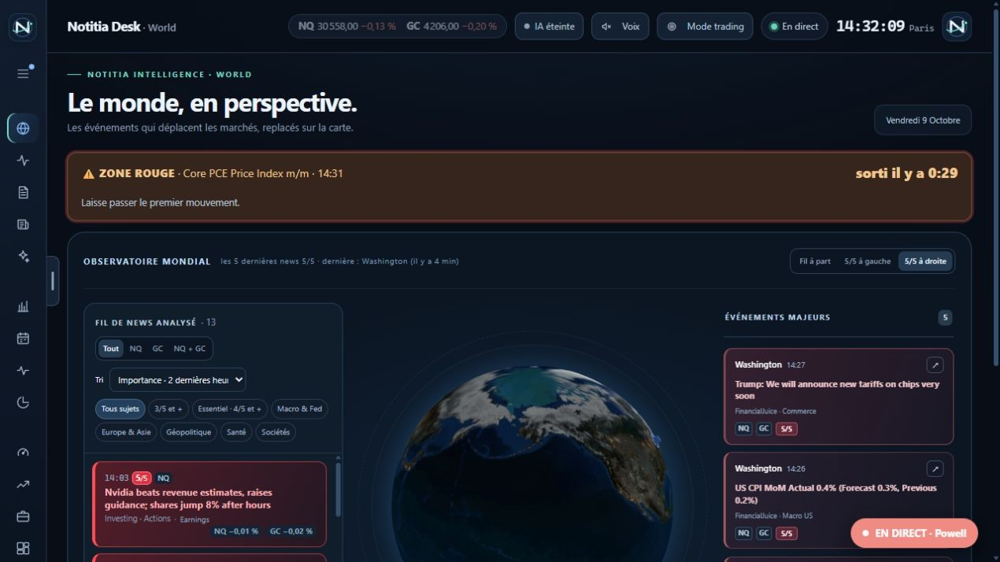

## Pouls du marché

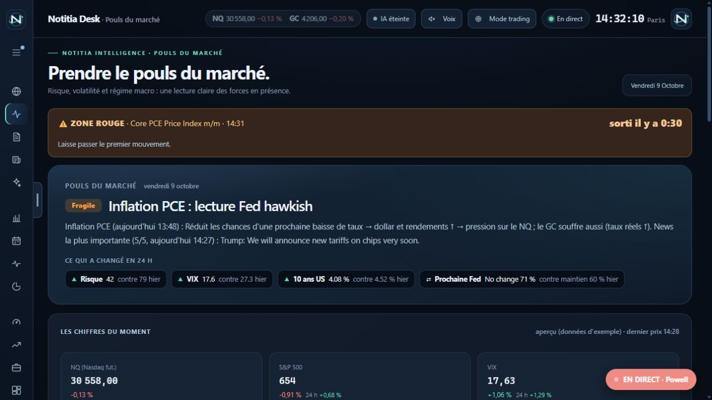

## Hebdo

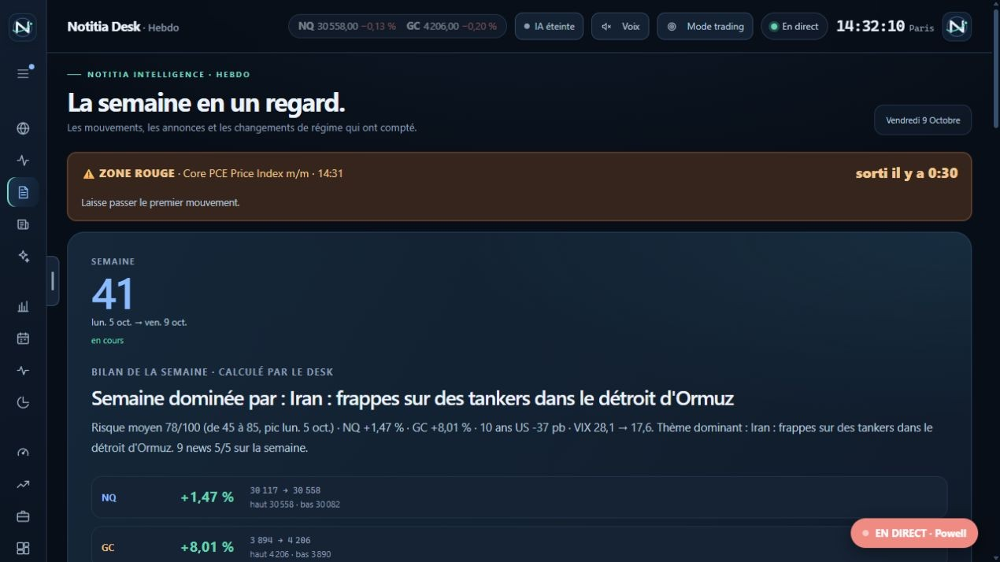

## Fil de news

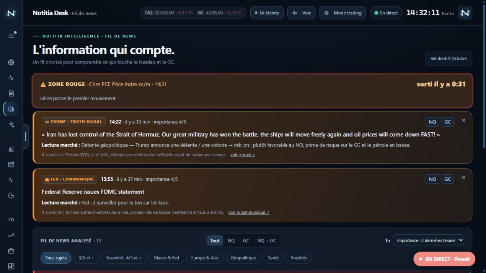

## Synthèse IA et récaps

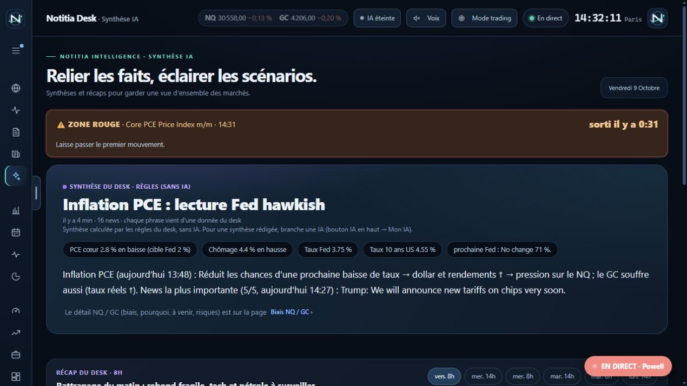

## Taux directeurs

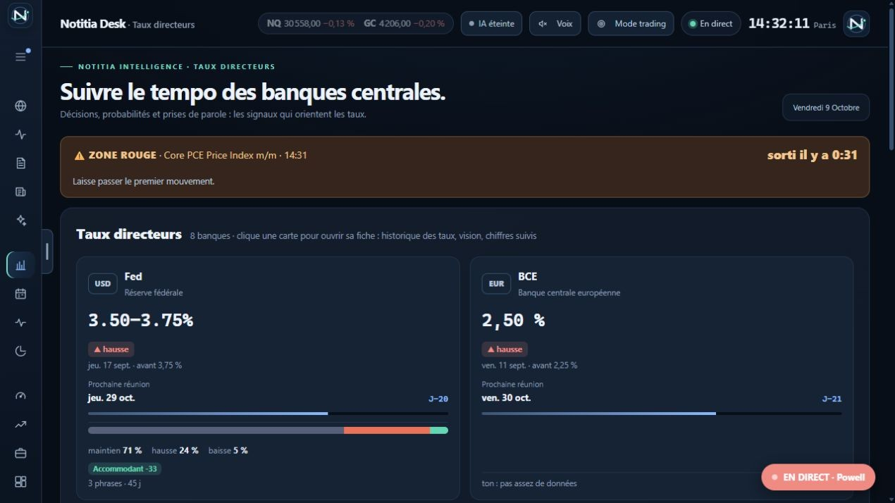

## Calendrier économique

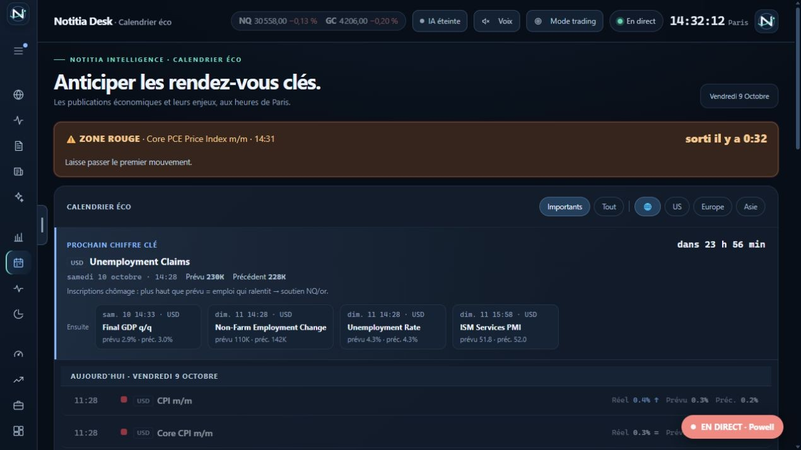

## Environnement macro US

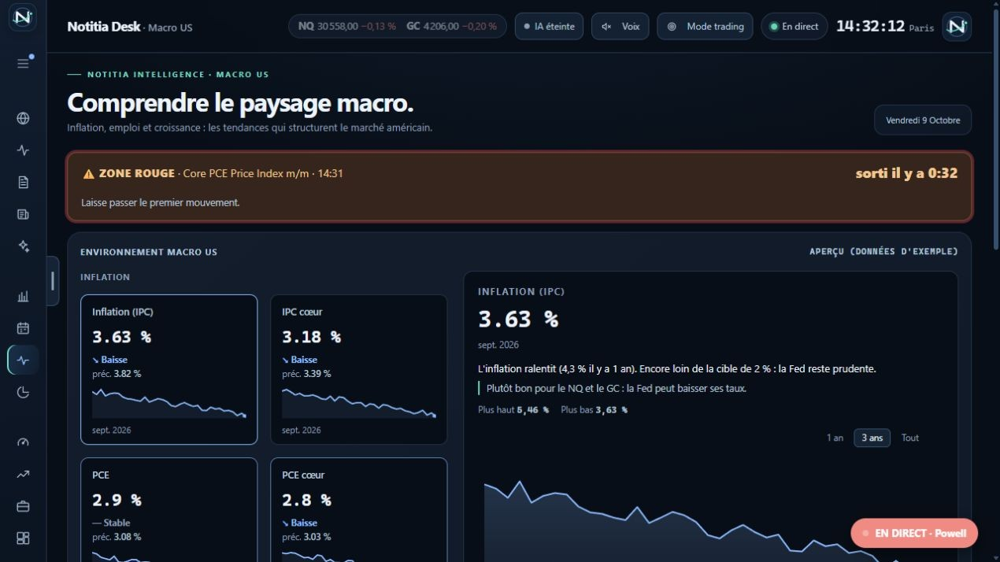

## Kalshi / Polymarket

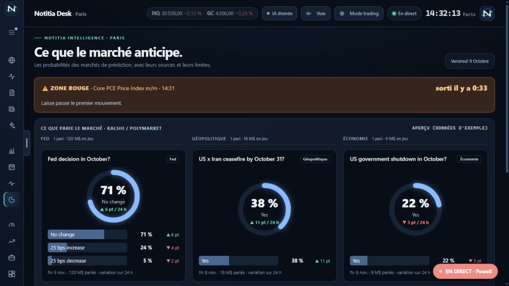

## Biais NQ / GC

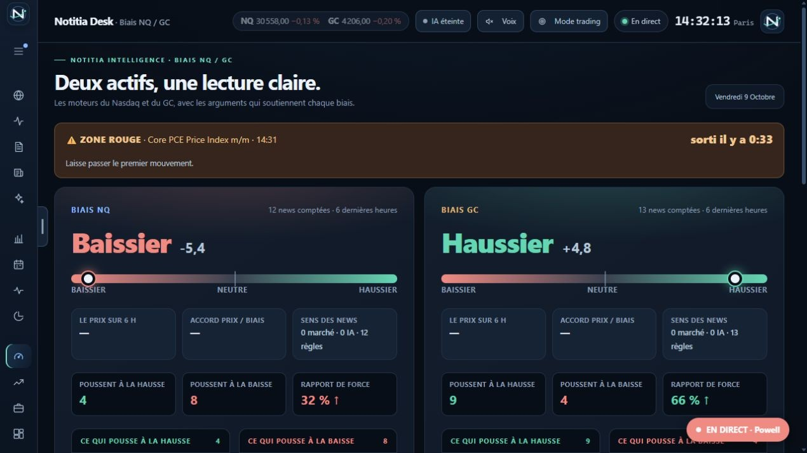

## Marchés mondiaux

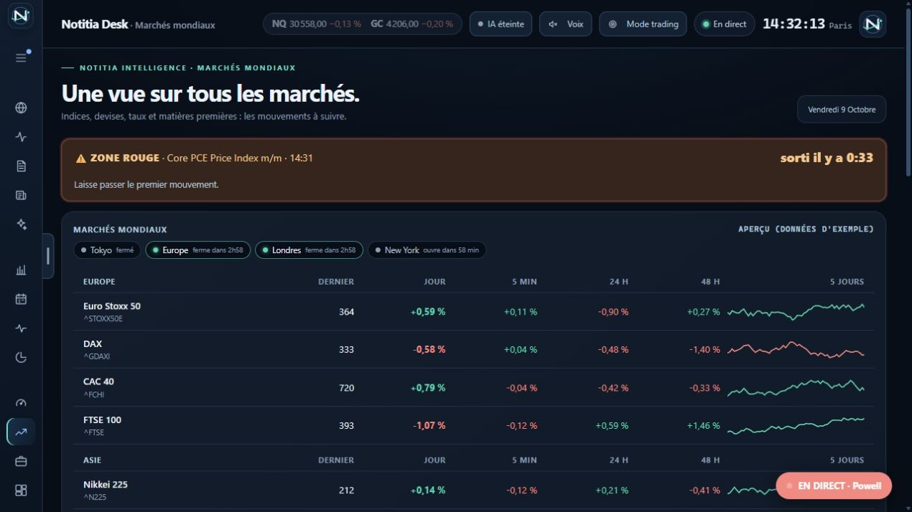

## Earnings Nasdaq

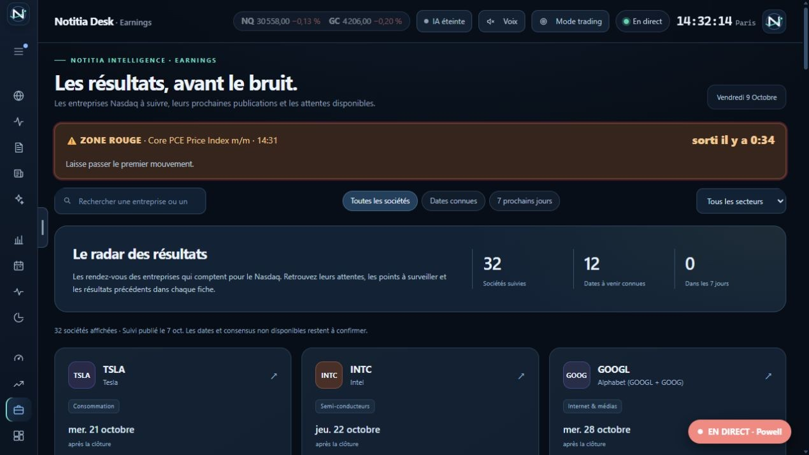

## Carte Nasdaq-100

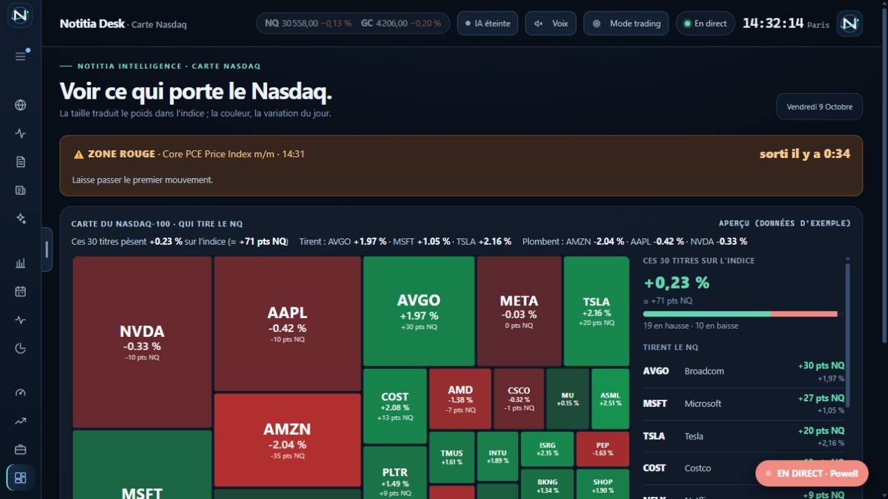

## Calendrier · compte à rebours

## Calendrier · fiche et scénarios

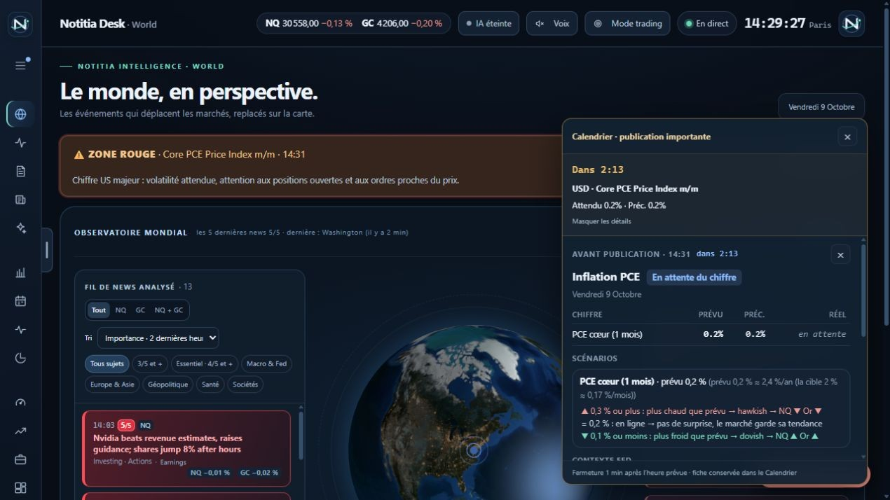

## World · globe et news sur les côtés

